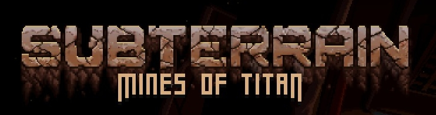

# Subterrain: Mines of Titan — Traducción al español de España

<p align="center"></p>

Traducción al **~80%** de **Subterrain: Mines of Titan** al español de España. Incluye todos los diálogos, cinemáticas, misiones, objetos, habilidades, tutoriales, logros y finales. **6.184 de 7.717 líneas con texto traducidas.**

---

## Calidad de la traducción

Esta no es una traducción automática de Google Translate ni un volcado de DeepL. Es el resultado de **muchas horas de trabajo humano combinado con IA**, en un proceso iterativo de revisión, corrección y mejora constante:

1. **Un agente de IA** (OpenCode + GLM-5.2) ejecutó la traducción inicial y los ajustes masivos siguiendo paso a paso la guía [`PLAN_TRADUCCION.md`](archivos/PLAN_TRADUCCION.md): un documento de **6.643 líneas** con reglas estrictas de naturalidad, fidelidad al contexto, consistencia terminológica, registro por personaje y preservación de etiquetas técnicas.

2. **Un humano supervisó todo el proceso** durante horas: revisando muestras en el juego, detectando textos genéricos repetidos que la IA no veía, encontrando descripciones cruzadas entre objetos, corrigiendo incoherencias, y ajustando el tono de cada personaje para que nada sonara "a traducción". La IA hizo el trabajo pesado, pero sin supervisión humana el resultado habría sido un desastre.

2. **No es una traducción literal.** Se sustituyeron frases hechas inglesas por expresiones naturales en español, se usaron sinónimos para dar coherencia a cada personaje, y se adaptaron los tonos (formal, coloquial, militar, científico) según el contexto del juego.

3. **El resultado es sólido**, con una base de ~80% de contenido traducido. Las entradas restantes (~20%) son puntuación (`...`), nombres propios (Ida, Alp, Grace...) e identificadores técnicos que no requieren traducción.

### Cobertura por categoría

| Categoría | Entradas | Traducido | Estado |
|---|---|---|---|
| Lore (libros, diarios) | 95 | 100% | Completo |
| Cinemáticas | 51 | 100% | Completo |
| Tips de carga | 12 | 100% | Completo |
| Guías y tutoriales | 218 | 98.6% | Casi completo |
| Historia principal | 993 | 98.3% | Casi completo |
| NPCs | 208 | 98.6% | Casi completo |
| Misiones secundarias | 2.132 | 97.1% | Casi completo |
| Ajustes de dificultad | 38 | 94.7% | Muy avanzado |
| Mensajes del sistema (Speech) | 45 | 53.3% | En progreso |
| Diario de misiones | 122 | 54.9% | En progreso |
| Descripciones (objetos/habilidades) | 975 | 46.6% | En progreso |
| Objetos del entorno | 194 | 28.9% | En progreso |
| Nombres (ítems, llaves, equipo) | 976 | 6.0% | Pendiente |
| Endings (finales) | 245 | 4.9% | Pendiente |
| IU (tooltips, botones) | 48 | 6.2% | Pendiente |
| Habilidades y perks | 83 | 0% | Sin traducir |
| Controles de teclado | 43 | 0% | Sin traducir |
| **Total** | **7.717** | **80.1%** | |

> **Nota:** Las categorías con bajo porcentaje son principalmente nombres propios, IDs técnicos y textos auxiliares. El contenido jugable (diálogos, misiones, historia, tutoriales) está prácticamente completo.

Si encuentras errores, [abre un issue](https://github.com) o un Pull Request con la corrección. Consulta [`GUIA_TECNICA.md`](GUIA_TECNICA.md) para saber cómo editar el bundle.

---

## 🌍 PLAN_TRADUCCION.md: la guía detrás de esta traducción

[`PLAN_TRADUCCION.md`](archivos/PLAN_TRADUCCION.md) es un documento de **6.643 líneas** escrito expresamente para este proyecto. Es el manual de instrucciones que se le dio a la IA para traducir el juego con coherencia y calidad profesional.

**Contenido:**

- Reglas de naturalidad, fidelidad al contexto y consistencia terminológica.
- Guías de registro por personaje (militar, científico, coloquial, formal).
- Normas estrictas para preservar etiquetas técnicas (`<b>`, `<color>`, `{0}`, etc.).
- Protocolo de revisión y corrección iterativa.

**¿Por qué está aquí?** Porque aunque se escribió para este proyecto concreto, cualquiera puede usarlo como punto de partida para traducir otros juegos. Es una guía completa de localización de videojuegos con IA, y si te sirve para tu propio proyecto, adelante.

---

## ⚠️ Advertencia importante

Por limitaciones técnicas del juego que no se pudieron solucionar:

- **El slot de idioma por defecto (Default), que originalmente contenía el inglés, se ha sobrescrito con la traducción al español.** El juego no tiene selector de idioma en los menús, y el sistema de localización de Unity no permite añadir un idioma nuevo sin modificar el código del juego. La única forma viable fue reemplazar el texto del slot Default.
- **Se han eliminado los directorios de los demás idiomas** (`Hu/`, `Kr/`, `Ru/`, `ZhCn/`) porque el juego podía cargarlos aleatoriamente y mezclar textos en varios idiomas.

**Esto significa que si instalas esta traducción, no podrás volver al inglés ni a ningún otro idioma** a menos que tengas una copia de seguridad manual del bundle original. Por eso es **obligatorio** hacer la copia de seguridad que se indica en los pasos de instalación.

---

## ⚠️ Descargo de responsabilidad

Esta traducción **modifica archivos internos del juego**. Aunque se ha probado y funciona correctamente, no se puede garantizar al 100% que no cause problemas en todas las configuraciones posibles (Steam, GOG, Heroic, Lutris, Steam Deck, distintas versiones del juego, etc.).

**Antes de instalar, haz copia de seguridad de:**

- La carpeta completa del juego (desde Steam: Propiedades → Archivos instalados → Examinar → copia toda la carpeta a otro sitio).
- Tus partidas guardadas (si las tienes).

**Al instalar esta traducción aceptas que:**

- Lo haces bajo tu propia responsabilidad.
- Ni el autor de la traducción ni los colaboradores se hacen responsables de ningún daño, pérdida de partidas guardadas, corrupción de archivos o cualquier otro problema derivado del uso de esta traducción.
- La única responsabilidad recae sobre el usuario que decide aplicarla.

Dicho esto: no se ha reportado ningún caso de problemas. Pero más vale prevenir.

---

## Instalación

### Windows (Steam)

1. Ve a la carpeta del juego: clic derecho en el juego en Steam → **Propiedades** → **Archivos instalados** → **Examinar...**
2. Navega a `Subterrain Mines of Titan_Data\StreamingAssets\aa\StandaloneWindows64\`
3. **Renombra** el archivo `localization_assets_localization.bundle` (ej: añade `.bak`) para tener copia de seguridad.
4. Copia `archivos/localization_assets_localization.bundle` de esta traducción en esa carpeta.
5. Inicia el juego. Debería aparecer en español.

### Linux / Steam Deck (Proton)

1. Encuentra la carpeta del juego:
   - **Steam Deck (interna):** `~/.local/share/Steam/steamapps/common/Subterrain Mines of Titan/`
   - **Steam Deck (SD):** `/run/media/mmcblk0p1/steamapps/common/Subterrain Mines of Titan/`
   - **Heroic / Lutris:** busca donde tengas instalado el juego.
2. Navega a `Subterrain Mines of Titan_Data/StreamingAssets/aa/StandaloneWindows64/`
3. Haz copia de seguridad:
   ```bash
   mv localization_assets_localization.bundle localization_assets_localization.bundle.bak
   ```
4. Copia el bundle traducido:
   ```bash
   cp archivos/localization_assets_localization.bundle .
   ```
5. Inicia el juego.

### Scripts automáticos

También puedes usar los scripts de instalación incluidos:
- **Windows:** ejecuta `instalar_windows.bat` (doble clic).
- **Linux/Steam Deck:** ejecuta `./instalar_linux.sh` desde terminal.

---

## Desinstalación (volver al inglés)

Restaura el archivo `.bak` que creaste durante la instalación. Si usaste el script automático, busca `localization_assets_localization.bundle.bak` en la misma carpeta y renómbralo eliminando el `.bak`.

**Nota:** esto solo restaurará el inglés. Para recuperar coreano, ruso, húngaro y chino necesitarás verificarlos desde Steam (clic derecho → Propiedades → Archivos instalados → Verificar integridad).

---

## ¿Quieres corregir algo o mejorar la traducción?

Lee [`GUIA_TECNICA.md`](GUIA_TECNICA.md). Contiene todo lo necesario para:
- Abrir, editar y guardar el bundle con UnityPy.
- Detectar textos sin traducir, en inglés residual, o genéricos repetidos.
- Exportar todos los textos a CSV para revisarlos.
- Instrucciones tanto para **humanos** (paso a paso con scripts de ejemplo) como para **agentes de IA** (referencia compacta).

También documenta todos los problemas técnicos del juego que han dificultado la traducción fan.

---

## Archivos del repositorio

| Archivo | Descripción |
|---|---|
| `archivos/localization_assets_localization.bundle` | Bundle traducido (listo para instalar) |
| `archivos/PLAN_TRADUCCION.md` | Guía de localización profesional usada por la IA |
| `GUIA_TECNICA.md` | Cómo editar el bundle (para humanos e IAs) + problemas del juego |
| `instalar_windows.bat` | Script de instalación para Windows |
| `instalar_linux.sh` | Script de instalación para Linux/Steam Deck |

---

## Créditos

Traducción, supervisión y corrección manual por mí, con asistencia de IA (OpenCode + GLM-5.2) siguiendo la guía de localización profesional [`PLAN_TRADUCCION.md`](archivos/PLAN_TRADUCCION.md).

---

## Licencia

Esta es una traducción no oficial realizada por fans. Todos los derechos del juego pertenecen a sus respectivos autores. Este proyecto no tiene ánimo de lucro.
